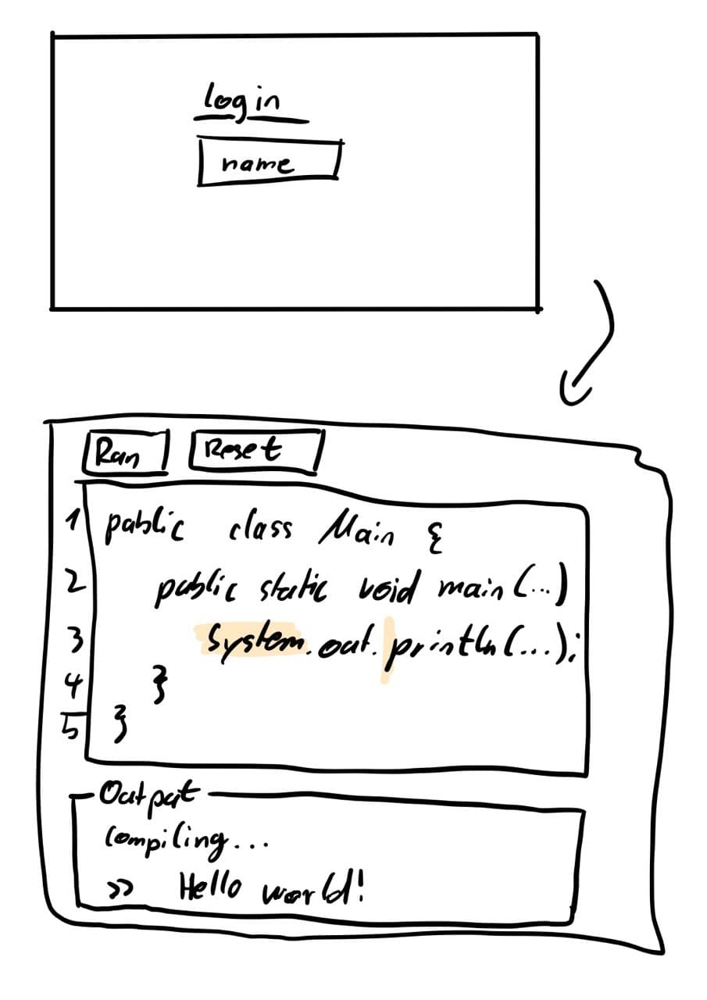
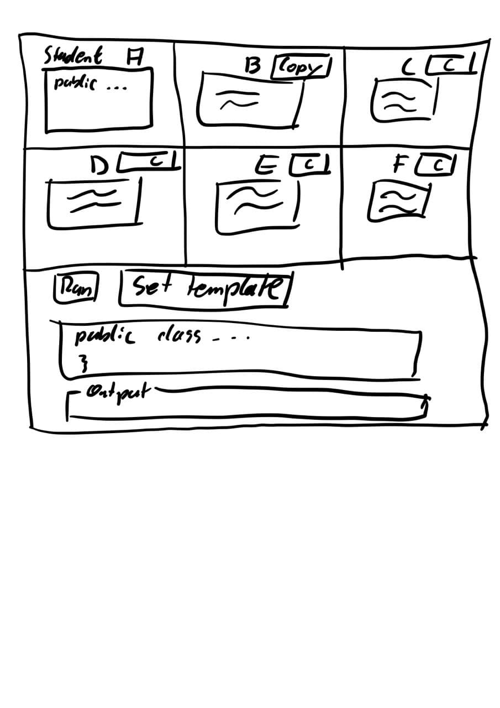

# Collaborative Educational Remote Code Execution and Teaching (CERCET)

## Requirements
### Component requirements
#### Editor
The editor is a normal editor like Notepad++ or Windows Editor that has to fulfill the following requirements:
- Java code highlighting (keywords, data types, ...)
- no intellisense or auto-completion
- line numbers
- auto indent
- tab should be replaced with 4 spaces

#### Remote code execution
The code in the editor can be compiled and executed.
The output of these processes will be shown to the user.

The execution process doesn't have to check any security issues like reflections or shutdown operations.

Compilation and execution will be done in its own process.
This allows the system to have a timeout for execution meaning that endless while loops will be terminated after X seconds.

#### Student overview
The student overview is a grid.
Each cell represents the current state of a student.
This includes the students editor component and the students name.

If the teacher clicks into a cell, the student will see the teachers mouse curser.
Same for selecting code, for instance using Strg + A.

In addition, the cell contains a button "Copy".
By clicking on "Copy" the current code will be copied to the teachers editor.

### Role-specific requirements
The system features two different views / roles: student and teacher.
The student should be able to write and execute code.
The teacher should have an overview of all his students and their code.

#### Student requirements
- the editor component
- a "Compile & Run" button that compiles and executes the code in the editor
- an output view that shows compile errors, default output stream and exceptions
- a "Reset" button that replaces the current code with the template code by the teacher
- teacher mouse curser
- teacher marked lines and words

#### Teacher requirements
- the student overview component
- a editor compoenent
- "Set template" button that will set the template code. The students can get the template by resetting
- real-time editor updates of all students
- optional: curser and marked text by the students

## UI mockups
### Student view

### Teacher view

## Implementation
### Frontend requirements
- UI components like buttons and text areas
- editor highlighting
- showing a curser
- showing a marked text selection

### Backend interfaces
#### Websockets
- real-time writing
- curser and marked text updates

#### REST
- set the template code
- get the template code
- login by name
